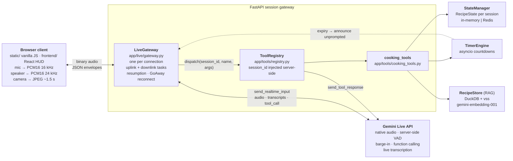

# 👨‍🍳 Kitchen Assistant — Executive Sous-Chef

A hands-free kitchen voice assistant built on **Gemini Live**, **FastAPI** and **DuckDB**. You talk,
it answers out loud — and while it answers it is actually setting timers, scaling the recipe you
loaded, converting units and moving through the steps, because the model calls real server-side
tools instead of just describing them.

Point a camera at the pan and ask "is this done?" and the frames go to the model alongside your
voice.

## Tech Stack


> *Recorded session replayed into the real UI: the components, the session state and every line of
> transcript are from an actual Gemini Live run (`assets/demo_session.json`) — only the WebSocket
> transport is stubbed, because a screenshot cannot hold a microphone.*

---

## ✨ What it does

- **🎙️ Hands-free, full-duplex voice.** Gemini Live's native audio in/out — server-side VAD and
  barge-in, so you can cut the assistant off mid-sentence and it stops talking.
- **⏱️ Real, overlapping timers.** `TimerEngine` runs actual `asyncio` countdowns. When one expires
  the assistant *announces it unprompted* — the engine nudges the model rather than waiting to be
  asked.
- **⚖️ Scaling and unit conversion.** "Double it" rewrites the ingredient list live; mass↔volume
  conversions are **refused** rather than guessed, since they need a density.
- **🔎 Semantic recipe search.** DuckDB + `gemini-embedding-001` (3072-d) over the recipe catalog —
  "something creamy with mushrooms" → load → step-by-step navigation.
- **📷 Camera doneness checks.** Throttled JPEG frames stream to the model with the audio.
- **🔁 Survives the session limit.** Live connections are time-limited; the gateway reconnects with
  a session-resumption handle without the browser noticing anything but a status change.
- **🖥️ Two clients, one protocol.** A build-free vanilla JS client and a React/TypeScript HUD speak
  the identical WebSocket protocol.

---

## 🏗️ Architecture

One `LiveGateway` instance per browser connection proxies audio, video and JSON envelopes between
the browser and a Gemini Live session. Tools never run in the browser and the API key never leaves
the server. Full component contracts and the ADRs are in [`ARCHITECTURE.md`](ARCHITECTURE.md).



<details>
<summary>Same diagram as a rendered image (<code>assets/architecture.png</code>)</summary>


Regenerate with `python scripts/render_architecture.py`.

</details>

**Browser-facing protocol** — binary frames are audio (16 kHz up, 24 kHz down); everything else is
a JSON envelope: `user.text`, `video.frame` up; `transcript.user`, `transcript.agent`,
`timer.update`, `timer.expired`, `interrupted`, `session.status`, `state.snapshot`, `error` down.
Both clients implement it identically, so the gateway does not know which one is connected.

---

## 📸 Screenshots

| | |
|---|---|
|  |  |
| **React HUD, idle** — a real browser connected to a running backend; the status flips to `READY` once the Live session is up. | **Vanilla JS client** — same recorded session, no build step, timer chips count down client-side. |

Regenerate everything with `python scripts/capture_screenshots.py` (add `--record` to capture a
fresh Live session first; needs `GOOGLE_API_KEY` and a local Playwright install).

---

## 📓 Notebooks

| Notebook | What it covers |
|---|---|
| [`01_recipe_eda.ipynb`](notebooks/01_recipe_eda.ipynb) | Exploratory analysis of the recipe catalog |
| [`02_multimodal_practice.ipynb`](notebooks/02_multimodal_practice.ipynb) | Early multimodal experiments (image + text prompting) |
| [`03_tool_implementation.ipynb`](notebooks/03_tool_implementation.ipynb) | Working out the cooking-tool contracts before they moved into `app/` |
| [`04_live_demo.ipynb`](notebooks/04_live_demo.ipynb) | **End-to-end demo — start here** |

`04_live_demo.ipynb` imports the real `app/` modules and runs the whole stack with outputs
committed: the atomic `StateManager`, a semantic search that really hits `gemini-embedding-001`,
the exact `FunctionDeclaration`s Gemini is shown, a full `registry.dispatch(...)` tool chain, a real
5-second countdown firing its proactive expiry callback, and finally a **real Gemini Live session
driven through the real `LiveGateway`** — the model picks the tool, the server dispatches it, and
~4 seconds of PCM16 speech comes back ([`assets/live_demo_reply.wav`](assets/live_demo_reply.wav)).

The only substitution is the browser: a scripted stand-in feeds one `user.text` envelope and records
the frames the gateway sends back. The two cells that need network access check for `GOOGLE_API_KEY`
and print a labelled skip line without one — nothing in the notebook fabricates model output.

---

## 🚀 Getting started

### Prerequisites
- Python 3.11+ and [Poetry](https://python-poetry.org/)
- A Google AI (Gemini) API key with Live API access
- Node.js 18+ (only to build the React HUD)

### Backend
```bash
git clone https://github.com/thompgt/kitchen-assistant.git
cd kitchen-assistant

poetry install
cp .env.example .env          # then fill it in — see the table below
poetry run uvicorn app.main:app --reload
```

Open **http://localhost:8000/** for the vanilla client. Microphone access requires `localhost` or
HTTPS.

### React HUD (optional)
```bash
cd frontend
npm install
npm run build     # → frontend/dist, served at /hud by the backend
```
Or run it standalone with hot reload: `npm run dev` (proxies `/ws` and `/health` to
`localhost:8000`).

### Configuration

Copy `.env.example` to `.env` and fill in. **Never commit `.env`.**

| Variable | Purpose | Default |
|---|---|---|
| `GOOGLE_API_KEY` | Gemini API access — required for voice and for semantic search | required |
| `LIVE_MODEL` | Live-capable model id (preview names churn) | `gemini-3.1-flash-live-preview` |
| `RECIPES_DB_PATH` | DuckDB recipe database | `data/recipes.db` |
| `APP_AUTH_TOKEN` | Shared token gating the voice WebSocket | unset (open access) |
| `USE_REDIS` | Use Redis for session state instead of memory | `false` |
| `REDIS_URL` | Redis connection string | `redis://localhost:6379` |

### Recipe catalog
The catalog ships pre-built in `data/recipes.db`. To rebuild it or add recipes, edit
`data/recipes_seed.json` and run:
```bash
poetry run python scripts/ingest_recipes.py       # load/validate the JSON catalog into DuckDB
poetry run python scripts/setup_vector_search.py  # embed any recipes missing a vector
```

### Auth
Open-access by default, which is fine on a trusted LAN. To gate it, set `APP_AUTH_TOKEN` and share
the URL with the token attached: `https://host/?token=<value>` — both clients forward it to the
WebSocket. This is one shared secret, not a user-account system: it is a single-deployment kitchen
appliance, and concurrent users already get isolated state via `session_id` (ADR-009).

### Docker
```bash
docker build -t kitchen-assistant .
docker run -p 8000:8000 --env-file .env kitchen-assistant
```
Or with Compose, which mounts `data/` so the catalog can be edited without a rebuild:
```bash
docker compose up --build
```
The image is a two-stage build (Node stage for the HUD, Python runtime for the rest). Redis only
matters with multiple replicas sharing session state — `docker compose --profile redis up` plus
`USE_REDIS=true` and `REDIS_URL=redis://redis:6379`.

### Tests and lint
```bash
poetry run pytest        # 80 tests; fakes the Live backend — no API key needed
poetry run ruff check .
cd frontend && npm run lint && npm run build
```
CI (`.github/workflows/ci.yml`) runs exactly this on every push and PR.

---

## ⚠️ Limitations

- **Preview-model churn.** Gemini Live model ids move; `LIVE_MODEL` is configurable for exactly that
  reason, and a stale id fails at connect time.
- **Vendor lock-in at the model layer.** ADR-001 trades three services (STT + LLM + TTS) for one.
  The browser protocol is deliberately vendor-neutral so the model layer can be swapped without
  touching the clients.
- **Tool turns exceed the latency budget.** The <800 ms glass-to-glass target covers plain
  conversational turns. A turn that calls a tool adds dispatch plus a second generation — accepted,
  not fixed.
- **Small catalog, brute-force search.** 16 recipes, ranked with `array_distance` over a
  `FLOAT[3072]` column. HNSW persistence in DuckDB is experimental, so the index is an optional
  speedup rather than a read-path requirement (ADR-004).
- **Single-node state by default.** `StateManager` is in-memory; state is lost on restart and not
  shared across replicas unless you turn on Redis.
- **Shared-token auth only.** No accounts, no per-user data isolation beyond `session_id`.
- **Browser requirements.** Mic capture needs `localhost` or HTTPS, plus `AudioWorklet` support.
- **Mass↔volume conversions are unsupported** by design — they need per-ingredient densities.

---

## 📁 Layout

| Path | Purpose |
|---|---|
| `app/main.py` | FastAPI app, `/ws/voice/{session_id}` route, static mounts, `/health` |
| `app/auth.py` | `APP_AUTH_TOKEN` shared-token gate |
| `app/live/gateway.py` | `LiveGateway` — browser WS ↔ Gemini Live proxy, one per connection |
| `app/tools/` | `cooking_tools.py` implementations + `registry.py` declarations and dispatch |
| `app/services/timer_engine.py` | asyncio countdowns with proactive expiry callbacks |
| `app/services/recipe_store.py` | DuckDB + vector search over the recipe catalog |
| `app/schemas.py` | All Pydantic models (single source of truth) |
| `app/state_manager.py` | Per-session state, in-memory by default, optional Redis |
| `static/` | Vanilla JS voice client, served at `/` |
| `frontend/` | React/TS/Tailwind/Zustand HUD, served at `/hud` once built |
| `scripts/` | Recipe ingestion, vector-search setup, Live smoke test, diagram and screenshot capture |
| `data/` | `recipes.db` (DuckDB) and `recipes_seed.json` (source of truth) |
| `notebooks/` | Exploration + the end-to-end live demo |
| `tests/` | pytest suite — fakes the Live backend and DuckDB, no external calls |
| `.gemini/skills/` | Authored skill specs behind the scaling and timer tools |

---

## 🛠️ Tech stack

**LLM** Google Gemini Live (native audio + function calling) · **Backend** FastAPI, async
throughout · **Database** DuckDB + `vss` · **Frontend** vanilla JS client and a
React/TypeScript/Tailwind/Zustand HUD · **Packaging** Poetry and npm · **CI** GitHub Actions (ruff,
pytest, frontend build) · **Deployment** Docker multi-stage build, docker-compose, optional Redis

---

## 📜 License
MIT. Created by [thompgt](https://github.com/thompgt).
