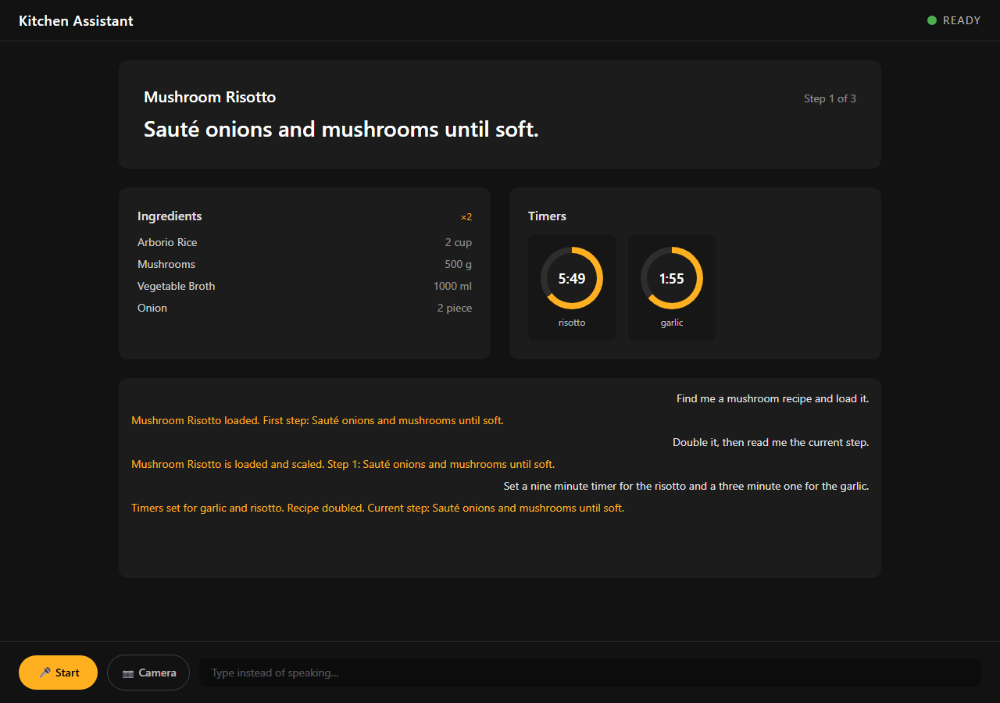
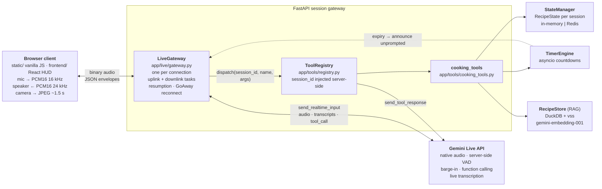
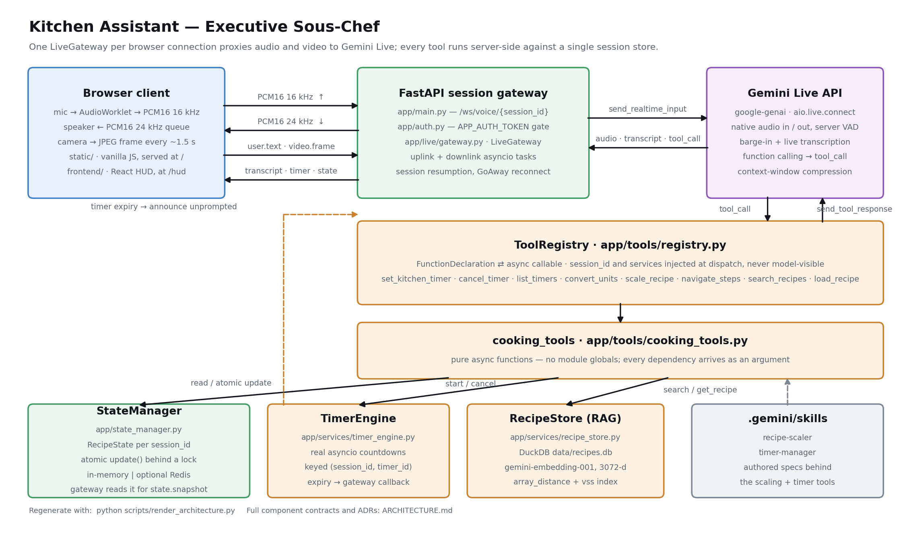
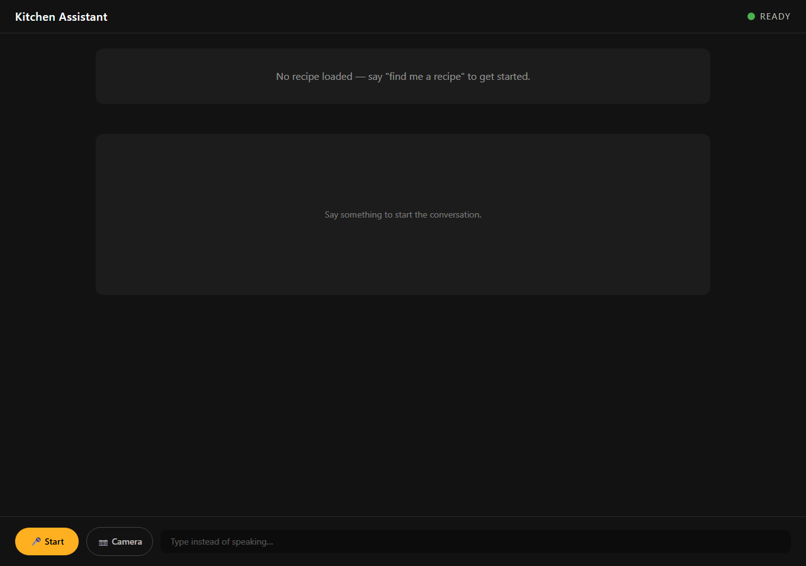
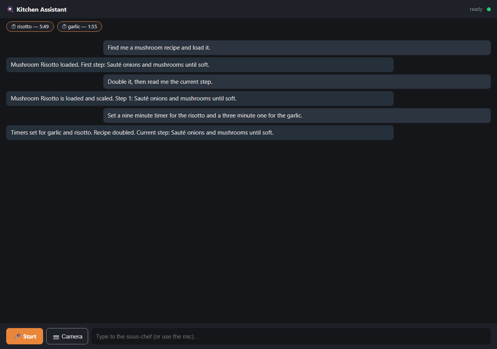

# Kitchen Assistant — Executive Sous-Chef

A hands-free, full-duplex voice assistant for the kitchen: you talk, it answers out loud, and while it answers it is actually setting timers, scaling the loaded recipe, converting units and moving through the steps — because the model calls real server-side tools instead of describing them.

## Tech Stack




> *Recorded session replayed into the real UI: the components, the session state and every line of transcript come from an actual Gemini Live run (`assets/demo_session.json`) — only the WebSocket transport is stubbed, because a screenshot cannot hold a microphone.*

---

## Why this matters

A kitchen is the worst possible place for a screen and a keyboard. Your hands are wet, covered in flour, or holding a pan. Three things are cooking at once on different clocks. The recipe is halfway down a page you can no longer scroll to, and the one question you actually need answered — *"is this browned enough?"* — is not a text query at all.

Most "voice assistants" fail here for a specific engineering reason: they are turn-based transcription pipelines bolted onto a chat model. You wait for a wake word, wait for silence detection, wait for a full transcript, wait for a reply. You cannot interrupt. And when the assistant says *"I've set a timer for 12 minutes"*, nothing anywhere is counting.

This project builds the thing that actually works in that environment:

- **Full-duplex, barge-in speech** — you cut the assistant off mid-sentence and it stops, because voice activity detection runs server-side on the audio stream, not on a finished transcript.
- **Tools with real side effects** — a timer is an `asyncio` countdown owned by the server, not a sentence. When it expires, the assistant *speaks up unprompted*; the engine nudges the model rather than waiting to be asked.
- **Multimodal grounding** — camera frames ride alongside the audio, so "is this done?" is answered from what the model sees in your pan.
- **Long sessions** — cooking takes 45 minutes; the underlying realtime connection is capped around 10. The gateway reconnects with a resumption handle and the browser never notices.
- **Honest refusals** — asking to convert grams to cups returns a structured error, because that needs a per-ingredient density. Guessing would ruin the dish.

It is also a deliberate exercise in the hard parts of production realtime AI: streaming audio through a proxy without transcoding, server-authoritative state under concurrent mutation, and testing a WebSocket-to-model bridge in CI with no API key and no network.

---

## Skills demonstrated

**Realtime & streaming systems**
- Bidirectional WebSocket proxy (`FastAPI` ↔ `Gemini Live`) with two concurrent `asyncio` tasks per connection and `asyncio.wait(FIRST_COMPLETED)` teardown that surfaces errors from either direction.
- Raw PCM16 audio passthrough with **zero transcoding** — 16 kHz mono uplink, 24 kHz downlink — and a documented format contract at every hop.
- Browser-side `AudioWorklet` mic capture (Float32 → Int16, ~20–40 ms frames) and a scheduled playback queue flushed on barge-in.
- Transparent reconnection across a hard session-duration limit using rolling resumption handles plus sliding-window context compression.

**LLM engineering**
- Function calling / tool use: eight `FunctionDeclaration` schemas, a registry that maps name → (declaration, async callable), and **server-side parameter injection** so `session_id`, the state store, the timer engine and the recipe store are never model-visible.
- Structured tool contracts — every tool returns `{"status": "success" | "error", ...}`; malformed model arguments are caught (`TypeError`) and reported back instead of crashing the session.
- System-prompt persona design (concise, no filler — appropriate for a noisy room).
- Native multimodal input: audio + video frames on one realtime channel.

**RAG & vector search**
- Embedding pipeline with `gemini-embedding-001` (3072-d), batched `RETRIEVAL_DOCUMENT` embedding at ingest, `RETRIEVAL_QUERY` at read time.
- DuckDB + the `vss` extension: `FLOAT[3072]` column, `array_distance` ranking, optional HNSW index — with a written justification for why brute force is correct at this catalog size.
- Sync-DB-in-async-app discipline: every DuckDB call is wrapped in `asyncio.to_thread` so it cannot block the event loop the voice session depends on.

**Async Python & concurrency correctness**
- Per-session `asyncio.Lock` and an atomic `update(session_id, mutator)` read-modify-write helper — no module-level mutable state anywhere in the tool layer.
- Task lifecycle ownership: countdowns keyed by `(session_id, timer_id)`, cancelled on disconnect so no orphans survive a dropped connection.
- Callback registration that inverts the dependency (the timer engine never imports the gateway — no cycles).

**Typed contracts & testing**
- Pydantic v2 as the single source of truth (`app/schemas.py`), mirrored into TypeScript interfaces on the client.
- 83 `pytest` / `pytest-asyncio` tests, including a **fake Live backend injected through a connect-factory constructor argument** — the gateway's reconnect, tool-dispatch and barge-in paths are all tested with no API key and no network.
- GitHub Actions CI running `ruff`, `pytest`, and a real frontend type-check + build.

**Frontend**
- React 19 + TypeScript (strict) + Vite + Tailwind + Zustand HUD, designed for glanceability across a room.
- A second, **build-free vanilla JS client** speaking the byte-identical WebSocket protocol — proof the server contract is genuinely client-agnostic.

**Packaging & ops**
- Poetry-managed Python 3.11+, multi-stage Dockerfile (Node stage builds the HUD, Python stage runs it), Docker Compose with an opt-in Redis profile, non-root container user and a `HEALTHCHECK`.
- Shared-token WebSocket auth using `hmac.compare_digest`, with a documented rationale for why full user accounts would be the wrong solution here.

---

## Architecture

One `LiveGateway` instance per browser connection proxies audio, video and JSON envelopes between the browser and a Gemini Live session. Tools only ever run server-side and the API key never leaves the server. Full component contracts and the ten ADRs are in [`ARCHITECTURE.md`](ARCHITECTURE.md).



<details>
<summary>Same diagram as a rendered image (<code>assets/architecture.png</code>)</summary>



Regenerate with `python scripts/render_architecture.py`.

</details>

### Models

**LLM — Gemini Live.** `LIVE_MODEL`, defaulting to `gemini-3.1-flash-live-preview` (`DEFAULT_LIVE_MODEL` in `app/live/gateway.py`, overridable by env var because preview ids churn). Connected via `google-genai`'s `client.aio.live.connect`. Session config (`build_live_config`), shared verbatim by the gateway and the smoke script:

| Setting | Value | Why |
|---|---|---|
| `response_modalities` | `["AUDIO"]` | Native speech out — no separate TTS |
| `system_instruction` | Executive Sous-Chef persona | Concise, no filler; instructed to use the camera for doneness verdicts |
| `tools` | `registry.live_tools()` | The eight declarations below |
| `input_audio_transcription` | enabled | Drives the on-screen transcript — no separate STT |
| `output_audio_transcription` | enabled | Same, for the assistant's side |
| `session_resumption` | rolling handle | Survives the connection time limit (ADR-005) |
| `context_window_compression` | sliding window | Long cooking sessions stay in budget |

**Embedding model — `gemini-embedding-001`, 3072 dimensions.** `RETRIEVAL_DOCUMENT` task type when embedding the catalog (batched, 20 per call, only for rows missing a vector); `RETRIEVAL_QUERY` when embedding a chef's search phrase.

**Tool schemas — 8 `types.FunctionDeclaration`s** (`app/tools/registry.py`). Declarations expose only user-meaningful parameters; server context is injected at dispatch:

| Tool | Model-visible parameters |
|---|---|
| `set_kitchen_timer` | `duration_seconds`, `label` |
| `cancel_timer` | `timer_id` |
| `list_timers` | — |
| `convert_units` | `value`, `from_unit`, `to_unit` |
| `scale_recipe` | `multiplier` |
| `search_recipes` | `query`, `k` |
| `load_recipe` | `recipe_id` |
| `navigate_steps` | `direction` (`next`/`previous`/`jump`), `step_index` |

**Data models — Pydantic v2 (`app/schemas.py`), the single source of truth.** `Ingredient`, `RecipeStep`, `RecipeMetadata`, `KitchenTimer`, `RecipeSearchResult`, and the central per-session `RecipeState`:

```
RecipeState
├── session_id: str
├── recipe_id: str | None
├── recipe_metadata: RecipeMetadata | None
├── current_step_index: int
├── active_timers: dict[str, KitchenTimer]
├── servings_multiplier: float
└── last_updated: datetime
```

`RecipeState` is serialized to the browser as a `state.snapshot` envelope and mirrored by TypeScript interfaces in `frontend/src/types.ts` and a Zustand store.

**Database schema — DuckDB (`data/recipes.db`), one `recipes` table, 16 rows:**

```
id VARCHAR PRIMARY KEY · title VARCHAR · ingredients JSON · steps JSON
total_time_minutes INTEGER · servings INTEGER · embedding FLOAT[3072]
```

### Browser-facing WebSocket protocol

Vendor-neutral by design — both clients speak it unchanged, so the gateway does not know which one is connected.

| Frame | Direction | Meaning |
|---|---|---|
| binary | both | PCM16 audio: 16 kHz up, 24 kHz down |
| `user.text` | client → server | Typed input in place of the mic |
| `video.frame` | client → server | Base64 JPEG camera frame, throttled ~1.5 s client-side |
| `transcript.user` / `transcript.agent` | server → client | Live transcription of each side |
| `timer.update` / `timer.expired` | server → client | Timer lifecycle |
| `interrupted` | server → client | Flush the playback queue (barge-in) |
| `session.status` | server → client | `ready` / `reconnecting` |
| `state.snapshot` | server → client | Serialized `RecipeState` |
| `error` | server → client | Structured error envelope |

### Component layout

```
kitchen-assistant/
├── app/
│   ├── main.py                    # FastAPI app: /ws/voice/{id}, /health, static mounts
│   ├── auth.py                    # APP_AUTH_TOKEN shared-token gate (hmac.compare_digest)
│   ├── schemas.py                 # All Pydantic models — single source of truth
│   ├── state_manager.py           # Per-session RecipeState; in-memory | Redis; atomic update()
│   ├── live/gateway.py            # LiveGateway: browser WS ↔ Gemini Live, one per connection
│   ├── services/
│   │   ├── recipe_store.py        # RAG: DuckDB + vss, search() / get_recipe()
│   │   └── timer_engine.py        # asyncio countdowns + proactive expiry callbacks
│   └── tools/
│       ├── cooking_tools.py       # 8 pure async tool implementations
│       └── registry.py            # FunctionDeclarations + dispatch with injection
├── static/                        # Vanilla JS client (index.html, app.js, pcm-worklet.js) → /
├── frontend/                      # React 19 + TS + Tailwind + Zustand HUD → /hud once built
│   └── src/
│       ├── hooks/useVoiceSocket.ts    # WS + AudioWorklet capture + playback + camera
│       ├── store/useSessionStore.ts   # Zustand mirror of RecipeState
│       ├── types.ts                   # TS mirror of app/schemas.py
│       └── components/                # StatusBar, InstructionCard, IngredientChecklist,
│                                      # ActiveTimerBoard, TranscriptPane, CameraPreview, MicButton
├── data/
│   ├── recipes.db                 # DuckDB catalog (16 recipes, embedded)
│   └── recipes_seed.json          # Catalog source of truth
├── scripts/
│   ├── ingest_recipes.py          # Seed JSON → DuckDB (idempotent, validating)
│   ├── setup_vector_search.py     # Embed missing rows + build HNSW index
│   ├── live_smoke.py              # One real round-trip through Gemini Live
│   ├── render_architecture.py     # Regenerate assets/architecture.png
│   └── capture_screenshots.py     # Regenerate assets/screenshots/
├── tests/                         # 80 pytest tests; fake Live backend, no network
├── notebooks/                     # EDA, multimodal practice, tool design, end-to-end demo
├── .gemini/skills/                # Authored skill specs behind scaling + timer tools
├── ARCHITECTURE.md  workplan.md  frontend_plan.md  CLAUDE.md
└── Dockerfile  docker-compose.yml  .env.example  .github/workflows/ci.yml
```

---

## How it works

**1. Connect.** The browser opens `ws://host/ws/voice/{session_id}?token=…`. `app/main.py` accepts, checks the token against `APP_AUTH_TOKEN` (`hmac.compare_digest`; open access when unset) and closes with code `4001` if it fails. On success it constructs one `LiveGateway` for that connection — no conversation state is shared between clients.

**2. Open the model session.** The gateway calls its connect factory (`client.aio.live.connect`, or an injected fake in tests), registers a timer-expiry callback for the session, and sends `{"type":"session.status","status":"ready"}`. Two tasks then run concurrently until either finishes.

**3. Uplink (browser → model).** The uplink task reads WebSocket messages. Binary frames are PCM16 16 kHz mic audio, forwarded straight through as `send_realtime_input(audio=Blob(mime_type="audio/pcm;rate=16000"))` — no buffering, no transcoding, no local VAD heuristic. JSON `user.text` becomes `send_realtime_input(text=…)`; `video.frame` base64-decodes to a JPEG blob and becomes `send_realtime_input(video=…)`. Unknown envelope types come back as a structured `error`.

**4. Downlink (model → browser).** The downlink task iterates `session.receive()` and routes each message: audio parts go out as binary frames; input/output transcriptions become `transcript.user` / `transcript.agent`; an `interrupted` flag becomes an `interrupted` envelope so the client flushes its playback queue instantly (this is barge-in); `session_resumption_update` stores the rolling handle; `go_away` returns from the task so the outer loop reconnects.

**5. Tool calls.** When the model emits a `tool_call`, the gateway hands each function call to `ToolRegistry.dispatch(session_id, name, args)`. The registry inspects the target function's signature and injects whichever of `state_manager`, `session_id`, `timer_engine`, `recipe_store` it declares — none of which the model can see or forge. Results go back as `types.FunctionResponse`, and the gateway follows up with a `state.snapshot` so the UI updates in lockstep with what the assistant is about to say.

**6. What the tools actually do.** `set_kitchen_timer` writes a `KitchenTimer` into state *and* starts a real `asyncio` countdown. `search_recipes` embeds the query and runs `array_distance` over DuckDB in a worker thread. `load_recipe` hydrates `RecipeState.recipe_metadata`, which is what gives `navigate_steps` real steps to clamp against and read back. `scale_recipe` recomputes actual ingredient amounts. `convert_units` normalizes aliases and case, and refuses mass↔volume rather than guessing a density.

**7. Proactive timer expiry.** When a countdown finishes, `TimerEngine` marks the timer inactive in state, then invokes the gateway's registered callback. The gateway sends `timer.expired` plus a fresh `state.snapshot` to the browser *and* injects a system turn into the Live session — so the assistant announces the timer out loud even though nobody asked it anything. Countdowns are cancelled when the session ends.

**8. Surviving the session limit.** Realtime connections are time-capped. On `go_away` (or any Live-side close), the outer loop reconnects with the stored resumption handle while holding the browser WebSocket open. The browser sees only `session.status: reconnecting` → `ready`; conversation context carries over. Reconnects that die inside five seconds — exhausted quota, a bad model id — back off exponentially with jitter and, after six consecutive failures, close the browser socket with an error rather than spin.

**9. State throughout.** Every mutation goes through `StateManager.update(session_id, mutator)`, which serializes read-modify-write behind a per-session `asyncio.Lock`. In-memory by default; Redis when `USE_REDIS=true`.

---

## How to run

### Prerequisites
- **Python 3.11+** and [Poetry](https://python-poetry.org/)
- A **Google AI (Gemini) API key** with Live API access ([aistudio.google.com/apikey](https://aistudio.google.com/apikey))
- **Node.js 22+** — only needed to build the React HUD (CI and the Dockerfile use Node 22)
- Optional: Docker, for the containerized path

### Install and run the backend

```bash
git clone https://github.com/thompgt/kitchen-assistant.git
cd kitchen-assistant

poetry install
cp .env.example .env          # then fill in GOOGLE_API_KEY — see the table below
poetry run uvicorn app.main:app --reload
```

Open **http://localhost:8000/** for the vanilla client. Microphone access requires `localhost` or HTTPS, plus `AudioWorklet` support.

`GET /health` returns `{"status", "redis_connected", "auth_enabled"}`.

### React HUD (optional)

```bash
cd frontend
npm install
npm run build     # → frontend/dist; FastAPI serves it at /hud when the directory exists
```

Or run it standalone with hot reload:

```bash
npm run dev       # Vite dev server; proxies /ws and /health to localhost:8000
```

The vanilla client at `/` keeps working either way.

### Configuration

Copy `.env.example` to `.env` and fill it in. **Never commit `.env`.**

| Variable | Purpose | Default |
|---|---|---|
| `GOOGLE_API_KEY` | Gemini API access — required for voice *and* for semantic search | required |
| `LIVE_MODEL` | Live-capable model id (preview names churn) | `gemini-3.1-flash-live-preview` |
| `RECIPES_DB_PATH` | DuckDB recipe database | `data/recipes.db` |
| `APP_AUTH_TOKEN` | Shared token gating `/ws/voice/{session_id}` | unset (open access) |
| `USE_REDIS` | Use Redis for session state instead of memory | `false` |
| `REDIS_URL` | Redis connection string | `redis://localhost:6379` |

**Auth.** Open by default, which is fine on a trusted LAN. To gate it, set `APP_AUTH_TOKEN` and share the URL with the token attached — `https://host/?token=<value>` — which both clients forward to the WebSocket. This is one shared secret, not a user-account system: it is a single-deployment kitchen appliance, and concurrent users already get isolated state via `session_id` (ADR-009).

### Recipe catalog

The catalog ships pre-built in `data/recipes.db` (16 recipes, already embedded). To rebuild it or add recipes, edit `data/recipes_seed.json` and run:

```bash
poetry run python scripts/ingest_recipes.py       # validate + load the JSON catalog into DuckDB (idempotent)
poetry run python scripts/setup_vector_search.py  # embed any rows missing a vector, build the HNSW index
```

`setup_vector_search.py` requires `GOOGLE_API_KEY`; `ingest_recipes.py` does not.

### Smoke test against the real Live API

```bash
poetry run python scripts/live_smoke.py
poetry run python scripts/live_smoke.py --wav ask_timer_16k.wav --out reply.wav
```

Sends a request through the exact `LiveConnectConfig` and `ToolRegistry` the gateway uses, prints transcripts and tool calls, and saves the spoken 24 kHz reply to a WAV file. Requires `GOOGLE_API_KEY`.

### Tests and lint

```bash
poetry run pytest        # 80 tests; fakes the Live backend — no API key, no network
poetry run ruff check .
cd frontend && npm run lint && npm run build
```

CI (`.github/workflows/ci.yml`) runs exactly this on every push and PR.

### Docker

```bash
docker build -t kitchen-assistant .
docker run -p 8000:8000 --env-file .env kitchen-assistant
```

Or with Compose, which mounts `./data` so the catalog can be edited without a rebuild:

```bash
docker compose up --build
```

The image is a two-stage build (Node 22 stage builds the HUD, Python 3.11-slim runtime serves everything), runs as a non-root `appuser`, and ships a `HEALTHCHECK` against `/health`. Redis only matters with multiple replicas sharing session state:

```bash
docker compose --profile redis up   # plus USE_REDIS=true and REDIS_URL=redis://redis:6379 in .env
```

### Regenerating assets

```bash
poetry run python scripts/render_architecture.py    # assets/architecture.png
poetry run python scripts/capture_screenshots.py    # assets/screenshots/ (--record for a fresh
                                                    # Live session; needs GOOGLE_API_KEY + Playwright)
```

---

## Notebooks

| Notebook | What it covers |
|---|---|
| [`01_recipe_eda.ipynb`](notebooks/01_recipe_eda.ipynb) | Exploratory analysis of the recipe catalog |
| [`02_multimodal_practice.ipynb`](notebooks/02_multimodal_practice.ipynb) | Early multimodal experiments (image + text prompting) |
| [`03_tool_implementation.ipynb`](notebooks/03_tool_implementation.ipynb) | Working out the cooking-tool contracts before they moved into `app/` |
| [`04_live_demo.ipynb`](notebooks/04_live_demo.ipynb) | **End-to-end demo — start here** |

`04_live_demo.ipynb` imports the real `app/` modules and runs the whole stack with outputs committed: the atomic `StateManager`, a semantic search that really hits `gemini-embedding-001`, the exact `FunctionDeclaration`s Gemini is shown, a full `registry.dispatch(...)` tool chain, a real 5-second countdown firing its proactive expiry callback, and a **real Gemini Live session driven through the real `LiveGateway`** — the model picks the tool, the server dispatches it, and ~4 seconds of PCM16 speech comes back ([`assets/live_demo_reply.wav`](assets/live_demo_reply.wav)). The only substitution is the browser. Cells needing network check for `GOOGLE_API_KEY` and print a labelled skip line without one — nothing fabricates model output.

## Screenshots

| | |
|---|---|
|  |  |
| **React HUD, idle** — a real browser connected to a running backend; status flips to `READY` once the Live session is up. | **Vanilla JS client** — same recorded session, no build step, timer chips count down client-side. |

## Limitations

- **Preview-model churn.** Live model ids move; `LIVE_MODEL` is configurable for exactly that reason, and a stale id fails at connect time.
- **Vendor lock-in at the model layer.** ADR-001 trades three services (STT + LLM + TTS) for one. The browser protocol is deliberately vendor-neutral so the model layer can be swapped without touching the clients.
- **Tool turns exceed the latency budget.** The <800 ms glass-to-glass target covers plain conversational turns; a tool turn adds dispatch plus a second generation — accepted, not fixed.
- **Small catalog, brute-force search.** 16 recipes ranked with `array_distance` over a `FLOAT[3072]` column. HNSW persistence in DuckDB is experimental, so the index is an optional speedup rather than a read-path requirement (ADR-004).
- **Single-node state by default.** `StateManager` is in-memory; state is lost on restart and not shared across replicas unless Redis is enabled.
- **Shared-token auth only.** No accounts, no per-user isolation beyond `session_id`.
- **Mass↔volume conversions are unsupported** by design — they need per-ingredient densities.

## License

MIT. Created by [thompgt](https://github.com/thompgt).
